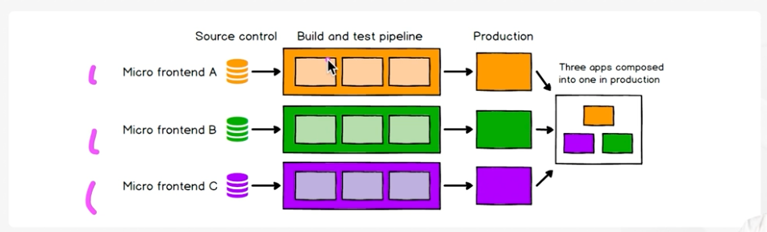

# MFA 의 필요 상황 진단하기

## 언제 MFA 의 도입을 검토 해야 할까?

서비스에서 발생 하는 문제들이 애플리케이션의 규모가 크기 때문이라 생각 될 때 검토를 고려 할 수 있습니다.  
반대로, 이러한 문제가 없을 경우 MFA 를 도입 할 만큼 규모가 큰 애플리케이션이 아닐 수 있습니다.

### 규모가 큰 Monolith 시스템에서 나타나는 전조 증상

1. 코드를 수정 한 뒤, 예기치 못한 곳에서 버그가 발생 합니다.
2. 새로운 기능 개발에 기존 코드를 활용하기 어렵습니다.
3. 간단한 수정사항을 적용하기 위해 통합, 테스트, 빌드 및 배포까지의 시간이 점점 길어집니다.
4. 작업을 위한 커뮤니케이션 비용이 점점 늘어납니다.
5. 동일한 기능을 제공하기 위해 여기 저기서 각각 개발하는 일이 늘어납니다.

하지만, 위와 같은 문제가 발생 한다 해서 반드시 MFA 도입이 필수적인 것은 아닙니다.  
적절한 규모의 팀을 구성 할 경우 문제를 적절히 해소 할 수도 있습니다.

> **적절한 규모의 팀이란?**  
> 한 팀이 원활히 의사소통을 하면서 해당 서비스의 모든 기능을 이해할 수 있는 수준입니다.  
> 따라서 적절한 규모라는 것은 팀의 상황마다 다를 수 있습니다.   
> 만일 적절한 규모의 팀을 넘어서 전조 증상들을 관리 할 수 없다면 MFA의 도입을 고려 해 볼 수 있습니다.

## MFA 도입의 장점

1. 덜 복잡하고 적은 양의 코드를 관리하기 때문에 코드의 품질이 높아집니다.
2. 배포의 범위가 줄어들기 때문에 빌드에서 배포 까지의 시간이 단축되고 위험도가 줄어듭니다.  

3. 단일 장애지점(Single Point Of Failure)을 피할 수 있습니다.
4. 점진적으로 업그레이드 하기에 용이합니다. (ex. 차세대 프로젝트)
5. 요구 사항에 맞춰 애플리케이션을 자유롭게 조립하여 제공 할 수 있습니다.
6. 독립적으로 개발 및 배포 할 수 있기 때문에 오너십을 가진 팀이 자유롭게 개발 일정을 조율 할 수 있습니다.
7. 팀이 주도적으로 자유롭게 기술 스택을 선택 할 수 있습니다.
8. 서로 다른 팀이 독립적으로 작업을 할 수 있기 때문에 개발 주기가 더 빨라질 수 있습니다.

## MFA 도입의 비용

1. 중복 코드가 발생 할 수 있습니다.
   * 중복 코드를 최소화 하기 위해 공통 모듈을 만들어 사용 할 수는 있습니다
   * 하지만, 공통 모듈을 관리 하는 비용 역시 크기 때문에 각각의 서비스에서 발생 하는 중복을 어느정도 감수 하는 선택도 가능합니다.
2. 전체적인 리소스의 크기가 커져 성능 저하에 대해 취약 할 수 있습니다.
3. 초기 구축 비용이 발생 합니다.
4. 다양한 마이크로 프론트엔드 간의 통합과 통신에서 추가적인 복잡성이 발생 할 수 있습니다.
5. 빌드 타임에서는 문제가 발생하지 않지만, 런타임에서 동적으로 통합 되는 과정에서 문제가 발생 할 수 있습니다.
6. 각각 자율적으로 발전하는 마이크로 프론트엔드 간의 일관적인 UX를 제공하기 위한 장치가 필요합니다.
   * 디자인 시스템 도입을 고려 해 볼 수 있습니다.
7. 마이크로 프론트엔드마다 기술적인 격차가 벌어질 가능성이 있습니다.

## MFA 도입이 적합한 상황

### 적절한 규모의 팀을 벗어난 경우
* 마이크로 앱으로 분리하여 각 팀마다 개발 할 인원이 충분한 경우 적합 합니다.
  * 프론트엔드 개발자가 많을 때
  * 크로스 펑셔널 팀을 조직 가능 할 때
* 소수의 개발자만 있고 의사소통에 문제가 없는 경우에는 MFA 도입의 이점보다는 비용이 더 클 수 있습니다.

### 기능적으로 마이크로 앱으로 분해가 가능한 경우
* 서비스가 URL 경로를 기준으로 기능적으로 구분이 가능한 경우 적합 합니다.
* 각 팀별로 책임이 명확하게 구분 가능 한 경우 적합 합니다.
  * 불분명하거나 중복된 영역(gray area)이 발생 하지 않아야 합니다.

### Runtime에서 여러가지 마이크로앱을 선택적으로 조립하여 제공해야 하는 경우

### 마이크로앱이 독립적으로 인프라 구성이 가능한 경우
* 클라우드 자원을 충분히 활용 가능 한 경우 적합 합니다.
* 같은 서버에 서로 다른 마이크로앱을 배포한 경우 도입의 의미가 적어집니다.

