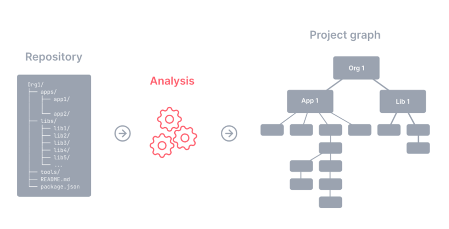

# MFA 설계 핵심 원칙과 기술

## MFA 를 규정하는 중요한 요소

### Independently Deliverable
* ~~독립적으로 유저가 사용 할 수 있는 앱~~
  * 반드시 독립적으로 유저에게 제공 될 수 있어야 할 필요는 없음
* 독립적으로 제공 가능한 프론트엔드 애플리케이션
* 독립적으로 개발 및 운영이 가능한 마이크로 앱
  * **독립적인 배포가 핵심**
  * 각각의 마이크로 애플리케이션은 개별로 배포가 가능해야 합니다.
  * 각자의 코드베이스에서 준비된 코드는 build & test pipeline 을 통해 최종적으로 production 으로 배포됩니다.
  * 복잡하고 거대한 앱을 작고 관리하기 쉬운 fragment 로 잘게 쪼개어 개발하면 많은 이점이 발생 합니다.
    * 기술 선택, 코드베이스, 팀 구성, 릴리즈 프로세스 등에서 독립적으로 작동하고 발전 할 수 있게 됩니다.

### Composed into a greater whole
* 작은 애플리케이션이 모여 더 큰 전체로 합쳐짐
* 마이크로 앱 여러개를 합쳐 하나의 커다란 웹 애플리케이션을 제공
  * 각각의 마이크로 애플리케이션이 각각 배포되어 합쳐져 하나의 애플리케이션을 구성합니다.
  * 개별 배포는 개별 실행을 의미하는 것은 아닙니다.
  * **조합 방식이 매우 중요**
    * 조합 방식에 따라 분해 방식 및 MFA 전체 형태도 결정 됩니다.
  * 복잡도가 올라 갈 수 있고 초기 설정이 필요 합니다.
  * 서로 연결하지 않아야 할 부분에 대해서 한번 더 점검 할 수 있고 종속성이 명확해집니다.

### Micro Frontends 와 BFF
시스템과 조직이 닮아 가도록 End to End team 을 구성하는 과도기적 단계에서  
현실적인 문제로 인해 즉각적인 전환이 어려울 경우 때문에 BFF 와 같은 레이어를 활용하여 점진적으로 migration 하는 방식을 고려 할 수 있습니다.

* 각 FE 애플리케이션의 요구사항만을 충족하는 백엔드 서버를 구축하는 BFF 패턴을 사용 할 수 있습니다.
* BFF 는 자체 비즈니스 로직과 DB를 갖춘 독립적인 서비스 일 수 있고, 하위 서비스에 aggregator 일 수도 있습니다.
* 타 팀의 하위 서비스에 마이크로 앱의 의존성이 발생해서 자율성 확보가 어려울 수 있습니다.
* 핵심은 독립적인 배포이기 때문에 점차 시스템과 팀을 독립적으로 운영 가능한 형태로 변경 해 가는것이 필요합니다. (어려운 문제)

## 서비스를 나누는 방법

### 서비스를 잘 나눠야 하는 이유

팀의 경계는 단순히 페이지 혹은 페이지들의 모임으로 구분 할 수 없는 경우가 많습니다.  
따라서 명확한 경계를 정해야 겹치거나 누락되는 영역이 발생하지 않습니다.  
또한 나누는 방식에 따라 runtime 에 마이크로 앱을 공유 받을 것인지, 한 팀에서 모두 담당 할 것인지를 결정 할 수 있습니다.

### 페이지의 구조를 통해 나누는 방법

* 모든 페이지의 경로를 리스트업 하고 유형을 분류하여 적절한 팀에게 나눠줍니다.
* 이미 운영되고 있는 서비스가 있을 경우 좀 더 유용할 수 있습니다.
* 일부 페이지에는 둘 이상의 관심사가 있을 수 있는데, 이럴 경우 잘라서 적당한 팀에게 분배 합니다.
  * 이 부분을 fragments 로 분리하여 runtime 에 제공 할 수 있습니다.

### 요구사항을 중심으로 나누는 방법

* 요구사항을 중심으로 팀을 구성하고 페이지와 fragments를 적절한 팀에게 분배 합니다.
* 결과적인 모습은 페이지 구조를 통해 나누는 방법과 유사 할 수 있습니다.

### 도메인 주도 설계를 통해 나누는 방법

* DDD의 도메인 논리와 바운디드 컨텍스트로 부터 팀의 경계를 구분 합니다.
* 기존에 MSA 가 견고하게 구성되어 있는 경우, MSA의 도메인 모델로 부터 도움을 받을 수 있습니다.
  * MSA 의 도메인이 UI로 드러나지 않는 경우도 있기 때문에 어려울 수 있습니다.

## MFA 와 Monorepo

> Monorepo 는 **잘 정의된 관계를 가진 여러개의 개별 프로젝트가 포함된 단일 리포지토리**

### Monolith Repo

* 한 저장소에 하나의 앱에 관련된 모든 코드와 리소스를 넣는 방식 입니다.
* 단일 프로젝트에 페이지, UI 컴포넌트, 상태관리 로직, 데이터 처리 등 모든 기능이 들어 있습니다.

### Modular Repo

* 소스코드를 여러개의 모듈로 나누고, 각각을 패키지로 만들어 필요한 다른 곳에서 가져다 쓰는 방식

### Monorepo & Polyrepo

| Monorepo                    | Polyrepo                    |
|-----------------------------|-----------------------------|
|  |  |

* 모듈로 나누어 연관 짓는다는 점은 동일합니다.
* 모듈들이 하나의 repo에서 관리되면 Monorepo, 모듈들이 별도의 repo 로 관리되면 Polyrepo(=Multirepo) 라고 합니다.

#### Polyrepo 의 단점

> Monorepo 는 아래와 같은 부분에서는 Polyrepo 보다 이점이 있습니다.

* 사용 중인 라이브러리의 이슈를 수정 해야 할 경우 번거롭습니다.
* 히스토리를 한번에 볼 수 없습니다.
* 기존 코드를 활용하려면 추가적인 비용이 듭니다.
* 프로젝트를 새로 생성 할 때 비용이 큽니다.
* 각 프로젝트마다 설정이 일관적이지 않아 컨텍스트 스위칭과 유지보수의 맥락이 끊깁니다.

#### Monorepo 의 단점

> Polyrepo 는 아래와 같은 부분에서는 Monorepo 보다 이점이 있습니다.

* 상대적으로 의존성의 연결이 쉽기 때문에 과도한 의존 관계가 나타 날 수 있습니다.
* 하나의 CI를 구성 할 수 있지만 방법이 복잡 할 수 있습니다.
* 저장소가 빠르게 무거워질 수 있습니다.
* 모든 코드가 밀집 되어 있기 때문에, 사소한 문제가 크게 확대 될 가능성이 있습니다.

### MFA 에 Monorepo 가 필요할까?

#### 이점
* 라이브러리의 이슈를 수정해야 할 경우 번거로운 일이 발생하지 않습니다.
  * 이슈 기반의 커밋이 가능
* 따라서, 전체 히스토리를 한번에 볼 수 있습니다.
* 기존 코드를 활용할 때 드는 비용이 작습니다.
* 프로젝트를 새로 생성 할 때 비용이 작습니다.
* 프로젝트마다 설정이 일관적이고, 같은 DX를 가질 수 있습니다.

#### 주의할 점
* 상대적으로 의존성 연결이 쉽기 때문에 과도한 의존관계가 나타나지 않도록 주의해야 합니다.
* 방법이 복잡 할 수 있으나 하나의 CI를 구성 할 수 있고 일관적인 DX 를 발전 시킬 수 있습니다.
* 모노레포 툴을 이용하여 성능에 주의를 기울여야 합니다. (빌드와 같은)
* 코드가 밀집되어 있어 사소한 문제가 크게 확대 될 가능성이 있음에 주의해야 합니다.
  * 여러 곳에서 사용되는 코드에 대해서는 각 프로젝트 담당자들과 함께 충분이 검증이 필요합니다.

#### 정리
* MFA 에 Monorepo가 꼭 필요 한 것은 아닙니다.
* 여러 프로젝트를 잘 정의된 관계를 가지도록 개발 해야 하기 때문에 개발 효율성 측면에서 좋은 옵션이 될 수 있습니다.
* 폴리 레포에 비해 이점이 많지만, 단점을 주의하여 사용해야 합니다.

## Monorepo 구현 방식

### Package Manager & Workspaces
| npm & yarn | pnpm                                  |
|------------|---------------------------------------|
|  |  |

npm, yarn, pnpm 과 같은 Package Manager에서 root project 내부에 workspaces 기능을 이용하여 여러 하위 패키지를 생성하고 연결 할 수 있습니다.  
`package.json` 혹은 `pnpm-workspace.yaml` 에서 workspaces 를 설정하여 여러 프로젝트 간의 의존 관계를 정의 합니다.

### Monorepo tool 의 필요성

* 개발 과정에서 여러 패키지들에 의존하게 되고, 특히 빌드 과정이 필요하기 때문에 속도에 대한 문제가 발생 할 수 있습니다.
* Repository 내 workspace 에 대한 분석와 시각화 기능을 제공 해 주기 때문에 전체적인 프로젝트의 상태와 의존 관계를 파악할 때 효과적입니다.
* 스케폴딩이나 코드 공유 & 사용 제한 등의 관리 측면에서 편의 기능을 제공합니다.
* Monorepo tool 에 대한 비교 및 이점에 대한 참고 문헌: https://monorepo.tools/

#### Monorepo tool 의 기능 및 이점

##### Local computation caching

##### Distributed computation caching

##### Local task orchestration

##### Distributed task execution

##### Detecting affected packages

##### Workspace analysis

##### Dependency graph visualization

##### Source code sharing

##### Code generation

##### Consistent tooling

##### Project constraints and visibility

