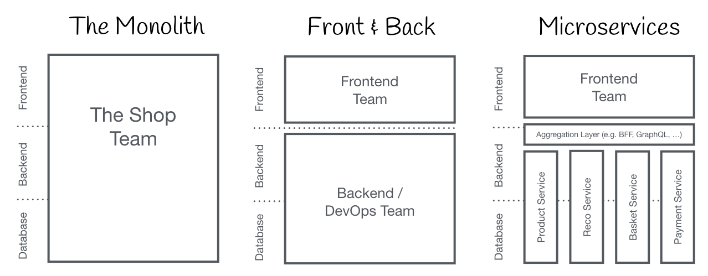
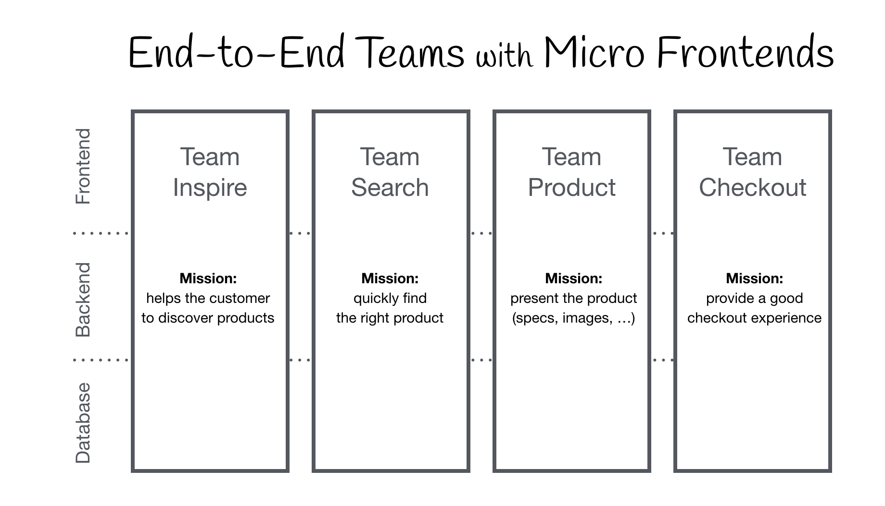

# MFA 의 등장

## 웹 개발의 발전 과정과 MFA 의 등장

### 주의
프로젝트의 성격, 현재 팀의 규모 등을 고려하여 상황에 맞는 아키텍처를 선택 해야 합니다.   
**절대적으로 옳은 아키택처는 없음**에 유의 해야 합니다.

### Monolithic Frontends

#### 1. The Monolith
* 팀은 하나의 모놀리스 시스템을 함께 만들게 됩니다.
* 웹서비스를 두루 잘 만들 수 있는 풀스택 개발자가 선호 될 수 있습니다.
* MVP를 빠르게 만들고 사업성을 증명 해야 할 필요가 있을 때 사용 될 수 있습니다.

#### 2. Frontend & Backend 분리
* 개발 효율성을 향상 시키기 위해 팀을 분리.
* FE 와 BE 팀이 나뉘고 팀 간에는 인터페이스(API)를 기반으로 소통 합니다.

#### 3. MicroServices
* BE 서비스를 더 전문적으로 개발 및 고도화 하기 위해 도입 합니다.
* BE API 들과 FE 사이의 비효율성 개선 목적으로 Aggregation Layer 를 둘 수 있습니다.
  * BFF(Backend For Frontend), GraphQL

### Micro Frontends

독립적으로 제공 가능한 FE 애플리케이션이 더 큰 전체로 구성되는 아키텍쳐 스타일 입니다.  
크고 복잡한 제품을 여러 팀에서 동시에 나누어 개발합니다.

## 기존 Architecture 와 MFA 비교

| 구분            | Monolithic Frontends | Micro Frontends |
|---------------|----------------------|-----------------|
| **초기 개발 속도**  | 빠름                   | 느림              |
| **빌드/배포 설정**  | 단순                   | 복잡              |
| **개발 환경 설정**  | 간단                   | 복잡              |
| **커뮤니케이션 비용** | 시스템이 커질수록 증가         | 작다              |
| **배포 시간**     | 시스템이 커질수록 느림         | 빠름              |
| **장애 파급 범위**  | 크다                   | 작다              |
| **자율성**       | 낮다                   | 높다              |

 
